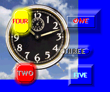



## Transparent Buttons \(UPDATED\)

### Description

----

UPDATED

----

90% speed increase for transparency math, as well as refresh speed. Also now uses a simple class module. Very easy to use and configure. I wrote this code to avoid having to design up and down images for projects with graphical skins. This code allows you to create rectangular and elliptical transparent buttons on any container without ActiveX controls. The code is completely modular and has many editable parameters.--- NOTE: If anyone knows how to hook / get procedure callbacks from classed-functions, please contact me.
 
### More Info
 

             |
---                |---
**Submitted On**   |2000-05-12 08:43:28
**By**             |[Dave Andrews](https://github.com/Planet-Source-Code/PSCIndex/blob/master/ByAuthor/dave-andrews.md)
**Level**          |Advanced
**User Rating**    |4.5 (27 globes from 6 users)
**Compatibility**  |VB 4\.0 \(32\-bit\), VB 5\.0, VB 6\.0
**Category**       |[Custom Controls/ Forms/  Menus](https://github.com/Planet-Source-Code/PSCIndex/blob/master/ByCategory/custom-controls-forms-menus__1-4.md)
**World**          |[Visual Basic](https://github.com/Planet-Source-Code/PSCIndex/blob/master/ByWorld/visual-basic.md)
**Archive File**   |[CODE\_UPLOAD57185122000\.zip](https://github.com/Planet-Source-Code/dave-andrews-transparent-buttons-updated__1-7880/archive/master.zip)

